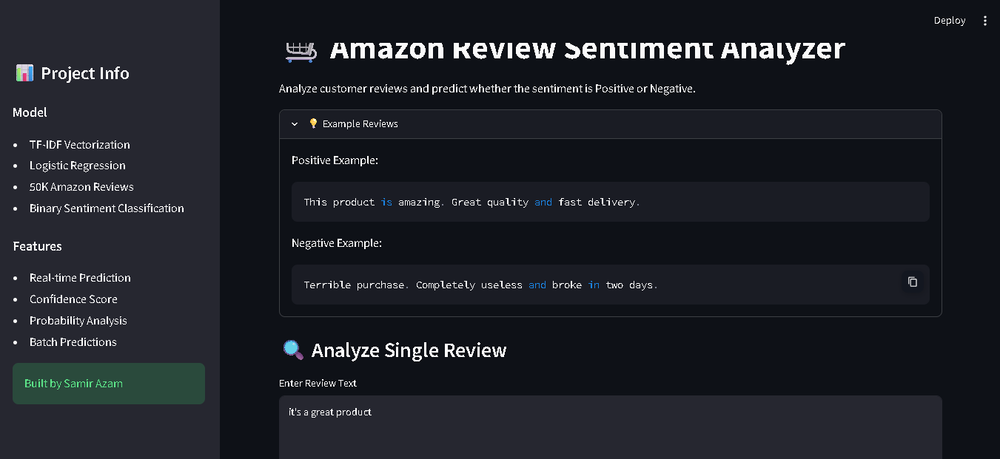
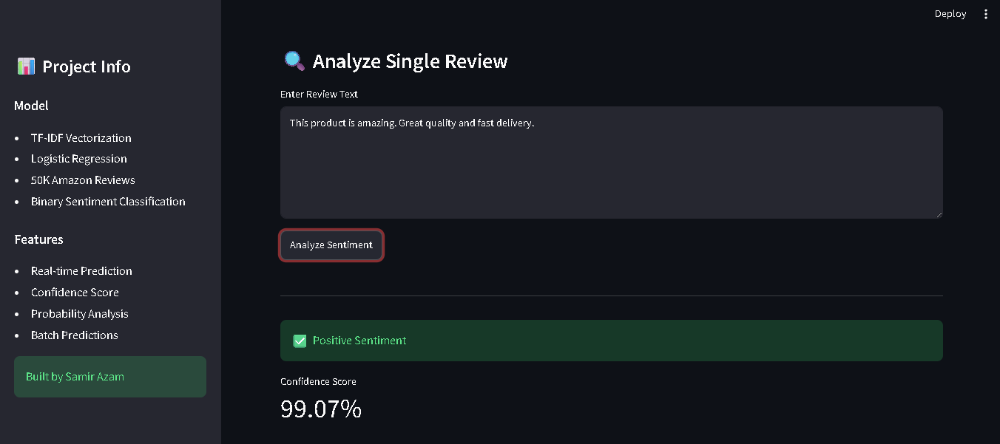
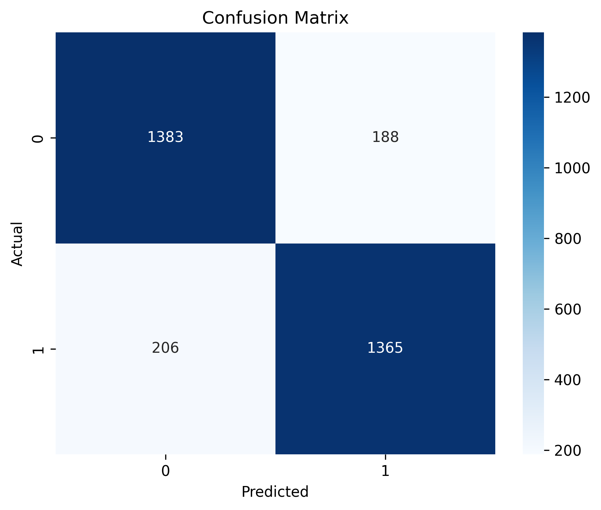
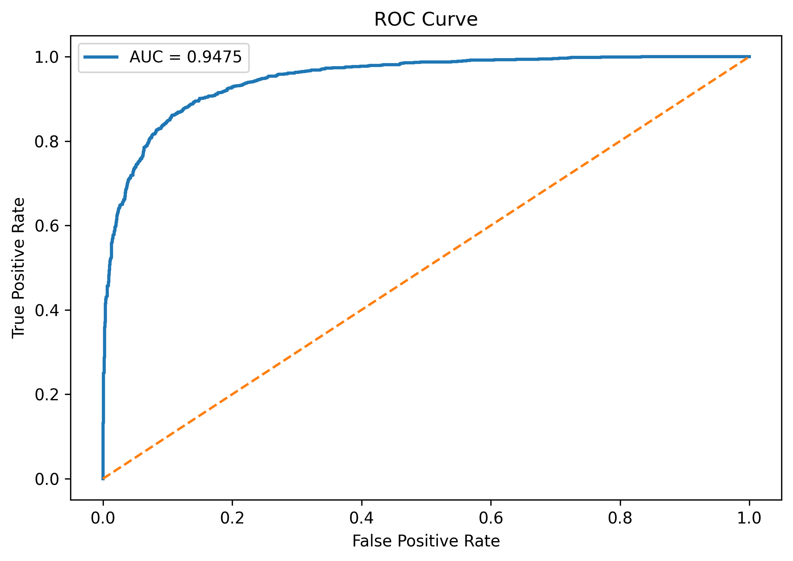
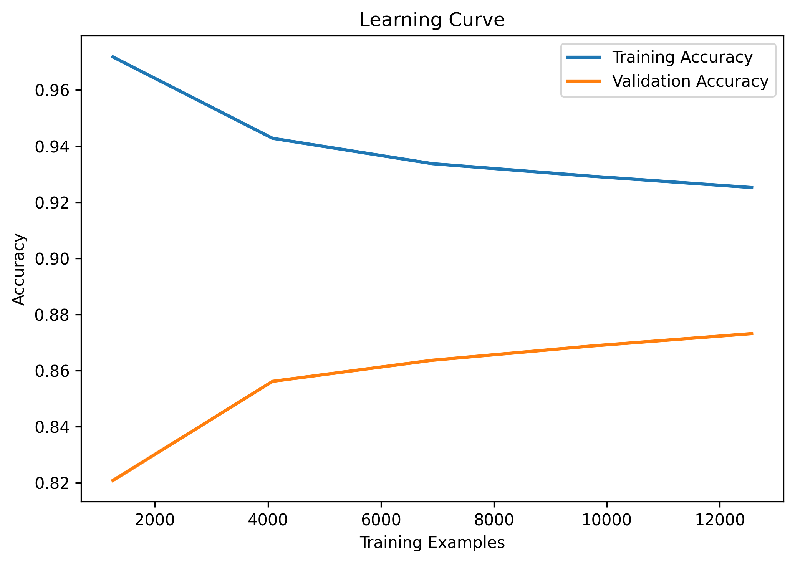

# Amazon Review Sentiment Analysis


## Overview

An end-to-end Natural Language Processing (NLP) project that classifies Amazon product reviews as **Positive** or **Negative** using **TF-IDF Vectorization** and **Logistic Regression**.

The project includes data preprocessing, feature engineering, model evaluation, visualization, error analysis, and an interactive Streamlit application for real-time sentiment prediction.

---

## Features

* Text preprocessing and cleaning
* TF-IDF feature extraction
* Logistic Regression classifier
* 5-Fold Cross Validation
* ROC Curve Analysis
* Confusion Matrix Visualization
* Learning Curve Analysis
* Error Analysis
* N-Gram Comparison
* Feature Importance Extraction
* Interactive Streamlit Web Application
* Batch Prediction Support

---

## Dataset

### Amazon Fine Food Reviews Dataset

* Source: Kaggle
* Reviews Used: 50,000
* Positive Reviews: Rating ≥ 4
* Negative Reviews: Rating ≤ 2
* Neutral Reviews Removed

Dataset Link:

https://www.kaggle.com/datasets/snap/amazon-fine-food-reviews

---

## Tech Stack

### Languages

* Python

### Machine Learning

* Scikit-Learn
* TF-IDF Vectorization
* Logistic Regression

### Data Processing

* Pandas
* NumPy

### Visualization

* Matplotlib
* Seaborn

### Deployment

* Streamlit

---

## Project Structure

```text
Amazon-Review-Sentiment-Analysis/
│
├── sentiment_classifier.py
├── evaluate.py
├── app.py
├── requirements.txt
├── Reviews.csv
├── screenshots/
│   ├── streamlit_home.png
│   ├── prediction_result.png
│   ├── confusion_matrix.png
│   ├── roc_curve.png
│   └── learning_curve.png
└── README.md
```

---

## Machine Learning Pipeline

### 1. Data Preparation

* Removed neutral reviews
* Converted ratings into binary sentiment labels
* Balanced class distribution
* Cleaned and normalized review text

### 2. Feature Engineering

TF-IDF Vectorization:

* Stop-word removal
* Sublinear term frequency scaling
* N-Gram experimentation
* Sparse feature representation

### 3. Model Training

Model Used:

**Logistic Regression**

Reasons:

* Strong baseline for text classification
* Fast training and inference
* Effective on sparse high-dimensional data
* Interpretable feature weights

---

## Model Performance

Evaluation performed on a held-out test dataset.

| Metric    | Score  |
| --------- | ------ |
| Accuracy  | 87.46% |
| Precision | 87.89% |
| Recall    | 86.89% |
| F1 Score  | 87.39% |
| ROC-AUC   | 94.75% |

### Cross Validation

The model was additionally validated using **5-Fold Cross Validation** to ensure robustness and generalization across multiple data splits.

---

## Visualizations

The project generates:

### Confusion Matrix

Visualizes correctly and incorrectly classified reviews.

### ROC Curve

Measures the model's ability to distinguish between positive and negative reviews.

### Learning Curve

Shows how model performance changes as the training dataset grows.

---

## Screenshots

### Streamlit Application

#### Home Page



Interactive interface for entering Amazon product reviews and performing real-time sentiment analysis.

---

#### Prediction Result



Displays predicted sentiment, confidence score, and probability distribution.

---

### Model Evaluation

#### Confusion Matrix



Visual representation of classification performance.

---

#### ROC Curve



**ROC-AUC Score: 94.75%**

Shows the model's ability to separate positive and negative reviews across classification thresholds.

---

#### Learning Curve



Illustrates model performance as the amount of training data increases.

---

## Streamlit Web Application

### Features

* Real-time sentiment prediction
* Confidence score visualization
* Probability distribution analysis
* Batch prediction using CSV uploads

Run locally:

```bash
streamlit run app.py
```

---

## Sample Prediction

### Input Review

```text
This product exceeded my expectations. Great quality and fast delivery.
```

### Output

```text
Positive Sentiment ✅
Confidence: 97%+
```

---

## Key Learnings

* Natural Language Processing (NLP)
* TF-IDF Feature Engineering
* Logistic Regression for Text Classification
* Cross Validation Techniques
* ROC-AUC Evaluation
* Error Analysis
* Model Interpretability
* Streamlit Deployment

---

## Future Improvements

* DistilBERT-based sentiment classification
* Logistic Regression vs SVM vs BERT comparison
* Explainable AI visualizations
* Cloud deployment
* Advanced hyperparameter optimization

---

## Resume Highlights

* Built an end-to-end NLP sentiment classification system on 50K Amazon product reviews using TF-IDF vectorization and Logistic Regression.
* Achieved **87.46% Accuracy** and **94.75% ROC-AUC** on binary sentiment classification.
* Performed cross-validation, confusion matrix evaluation, learning curve analysis, and error analysis.
* Developed an interactive Streamlit application for real-time sentiment prediction and batch review analysis.

---

## Author

**Samir Azam**

GitHub: https://github.com/Samir-Azam

LinkedIn: https://linkedin.com/in/samir-azam
